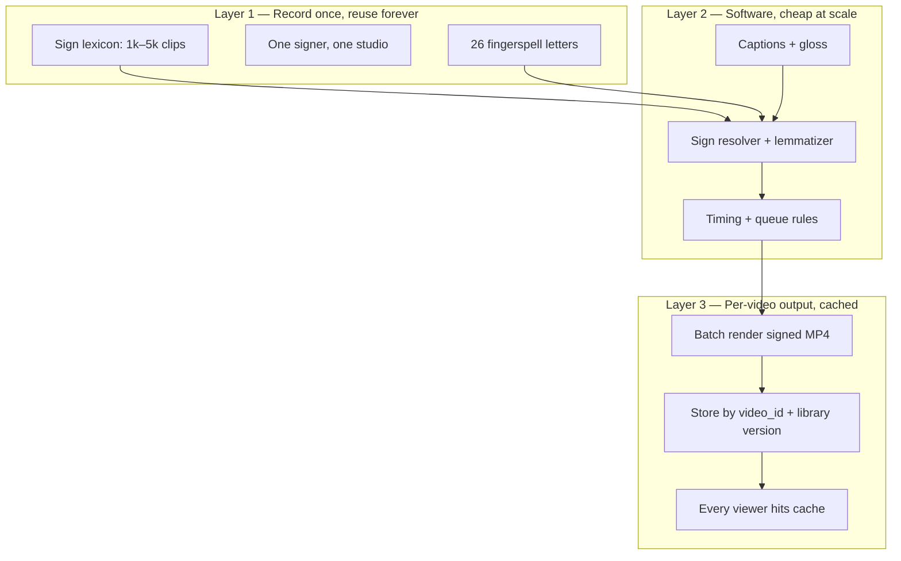
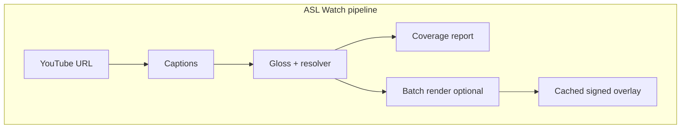

# Plan: Real ASL for Deaf Users

**Status:** Updated June 2026 (competitor-informed)  
**Audience:** Product + engineering + business  
**Goal:** Move from a demo (gloss text + robot gestures) to something **Deaf viewers can actually follow** while watching YouTube.

**Competitors analyzed:** [Migam.ai](https://www.migam.ai/) · [Signapse.ai](https://www.signapse.ai/)

---

## 1. Honest assessment — why it doesn’t work today

| Layer | Today | Problem for Deaf users |
|-------|--------|-------------------------|
| **Avatar** | Xbot robot | Not a human signer; no believable hands/face |
| **Signs** | Generic clips (`agree`, `walk`) | Not ASL — wrong handshapes, movement, location |
| **Gloss** | LLM English→gloss text | Gloss ≠ sign lookup key; errors, wrong lemmas |
| **Timing** | Equal split across sentence | Unnatural signing speed; signs need different durations |
| **Grammar** | Text tokens only | Missing **non-manual markers** (brows, head tilt, mouthing) |
| **Fallback** | Random body animation | Worse than showing nothing — misleading |

**Bottom line:** The pipeline proves *automation* works. It does **not** produce comprehensible ASL.

---

## 2. How Migam & Signapse do it (competitor analysis)

Both companies sell **enterprise accessibility** (EAA, ADA, transit, media) — not consumer YouTube overlays. Their tech stacks differ in an important way.

### Migam.ai — photorealistic 3D avatar + API

| Aspect | What they claim / do |
|--------|----------------------|
| **Product** | “Sign language button” — one API call embeds ASL into any platform |
| **Pipeline** | Content (text/audio/video) → **AI sign sequence** → **photorealistic 3D avatar** streams back |
| **Avatar** | Unreal Engine + **MetaHuman**; modular skins; facial expression required |
| **Data** | Trained on authentic Deaf signing; validated by native signers; **20+ sign languages** |
| **Team** | **40% Deaf or CODA**; 15+ years via [migam.org](https://migam.org/) (1,750+ enterprise deployments in Poland) |
| **MoCap** | Partnership with motion-capture studios (e.g. Bones Studio) |
| **API** | `POST /api/v1/translate` → `{ stream_url }` |
| **Buyers** | Banks, telecom, government, media, conferencing, healthcare |
| **Moat** | Scale, multi-language, enterprise trust, R&D budget, Deaf-led validation |

**Likely architecture (inferred):** Real signing data → motion retargeting or learned avatar controller → MetaHuman render → HLS/WebRTC stream. **Heavy R&D, heavy capex.**

---

### Signapse.ai — gloss + real signer video + AI blending

| Aspect | What they claim / do |
|--------|----------------------|
| **Product** | **SignStudio** (post-production video) + **SignStream** (real-time API, ~20–40s per sentence) |
| **Pipeline** | **Two explicit steps** (documented in their blog): |
| | 1. **English → Gloss** — LLM trained on **thousands of real BSL gloss sentences** |
| | 2. **Gloss → Video** — select clips from **library of qualified signer videos** + **AI blending** (GANs) |
| **Sign library** | Large dataset of **pre-recorded videos by qualified Deaf translators** |
| **QC** | Manual gloss check **before** video gen; **≥2 Deaf staff** rate comprehension before release |
| **Ethics** | Pays translators whose likeness is used; Deaf Advisory Board |
| **Traction** | **5,000+ BSL train announcements/day** (UK rail); ASL expansion for enterprise |
| **Buyers** | Transport, corporate comms, live events, media post-production |
| **Moat** | Sign video library, domain-tuned gloss LLM, blending IP, Deaf QA workflow |

**Key insight:** Signapse does **not** rely on a robot with procedural hands. They **composite real human signing footage** (with generative blending for smooth transitions). This is closer to what a small team can replicate.

Sources: [Signapse — How our AI works](https://www.signapse.ai/post/how-does-our-ai-technology-work) · [Signapse homepage](https://www.signapse.ai/) · [Migam.ai](https://www.migam.ai/)

---

### Side-by-side

| | **Migam** | **Signapse** | **ASL Watch (today)** |
|--|-----------|--------------|------------------------|
| Input | Text, audio, video | Text, announcements, video | YouTube captions |
| Language layer | Proprietary AI + Deaf validation | **LLM gloss** + human QC | OpenAI gloss (no QC) |
| Signing output | **3D MetaHuman avatar** | **Real signer video** + GAN blend | Xbot + fake clips |
| Latency | Real-time stream (claimed) | ~20–40s/sentence (API) | Seconds (but useless output) |
| Deaf involvement | 40% team Deaf/CODA | Advisory board + paid translators + QC | None yet |
| Business model | Enterprise API | Enterprise API + SignStudio SaaS | None |
| Best for us to copy | API packaging, Deaf-led brand | **Gloss → video library pipeline** | YouTube consumer wedge |

---

## 3. Product positioning — what ASL Watch actually promises

**We do not promise:** perfect ASL for every YouTube video, every sentence, instantly, with a different look every time.

**We do promise:**

> **Cached ASL overlay for captioned YouTube — with an honest coverage score.**  
> Not full human interpretation. Signed where the library matches; fingerspelled or flagged where it doesn’t.

| Promise | Meaning |
|---------|---------|
| **Coverage %** | “This video is 72% signed, 18% fingerspelled, 10% gloss-only” |
| **One primary signer** | Same person, same studio — not a new face per word |
| **Per-video cache** | Translate once, replay forever — work scales with videos, not viewers |
| **Improving lexicon** | Library grows (100 → 500 → 2k signs); coverage goes up over time |
| **Domain honesty** | Education / clear speech first; chaotic vlogs last |

This matches how **Signapse wins in rail** (bounded phrases) applied to **YouTube** (unbounded, but cached + coverage-scored).

---

## 4. Scalability model — how this scales without recording the world

### The misconception

| ❌ Does not scale | ✅ What actually scales |
|------------------|-------------------------|
| Record every sentence in every video | Record a **finite sign lexicon** once (~1k–5k clips) |
| One new video = new filming | One new video = **automated compose** from existing clips |
| Billions of English sentences | **Thousands** of ASL signs + **composition rules** |
| 100% coverage Day 1 | **Coverage curve** that improves as library grows |

You scale like a **dictionary + compiler**, not like a **subtitle archive for all speech ever spoken**.

### Three layers



**Layer 1** — Expensive once (~$25k–75k for 500 signs), then **marginal cost ≈ $0** per reuse.  
**Layer 2** — Engineering (captions, gloss, lookup) — **pennies per video**.  
**Layer 3** — One render job per YouTube URL (or per library upgrade); **millions of views don’t multiply recording cost**.

### Vocabulary coverage curve (Pareto)

Most tokens in everyday speech come from a small set of signs. Library size vs **unique gloss token** coverage (rough industry estimates):

| Sign library size | Typical token coverage | Good for |
|-------------------|------------------------|----------|
| 100 | Demo / pilot | Proof of pipeline |
| 500 | ~50–65% | Simple edu, slow speech |
| 2,000 | ~75–85% | General YouTube (with gaps) |
| 5,000+ | Diminishing returns | Hard slang, names, niche jargon remain |

**Long tail** is handled by **fingerspelling** (26 clips) + **honest “unsigned” gloss** — not by recording infinite new signs.

### Per-video batch render (key scalability trick)

**Live stitch** (clip → clip while you watch) = choppy, slow, hard.  
**Batch render** (Signapse SignStudio style) = smoother, cacheable, scalable.

```
First viewer (or creator) requests video X
  → captions + gloss + resolve signs
  → ffmpeg compose → signed_overlay_X_v3.mp4
  → store on CDN (key: video_id + sign_library_version)

All later viewers
  → stream cached MP4 alongside YouTube
  → no new OpenAI, no new compose (until library updates)
```

**Compute scales with unique videos processed, not with watch time.**

### One signer, not many

Scalability requires **consistency**, not variety:

- **One primary Deaf signer** records the entire lexicon  
- Optional **second signer** = separate asset pack (user chooses “Signer A”)  
- Changing signer = **re-record library** (v2), not mix signers per token  

This avoids the “different person every word” uncanny effect.

### Choppiness vs naturalness

| Approach | Naturalness | Scalability |
|----------|-------------|-------------|
| Live clip stitching | Low–medium | High |
| Batch sentence render + crossfade | Medium | High |
| GAN blending (Signapse) | Medium–high | Medium (GPU cost) |
| 3D avatar (Migam) | Medium–high | High at runtime, high R&D |
| Human interpreter live | Highest | Does not scale |

**Plan:** Start with batch render + simple crossfade (Phase 2–3); add blending (Phase 5) or 3D (Phase 6) when funded.

### What stays hard (industry-wide ceiling)

Even Signapse (~20–40s/sentence) and Migam (enterprise R&D) **do not** solve:

- Perfect ASL for **all** casual YouTube at interpreter quality  
- Zero-latency arbitrary open vocabulary  
- Automatic classifiers / spatial grammar without errors  

**ASL Watch wedge:** Be the **honest, improving, YouTube-native** layer — not “we replaced interpreters everywhere.”

### Scalability by go-to-market

| GTM | Scales because |
|-----|----------------|
| **Consumer extension** | Cache per video; freemium on “process this URL” |
| **Creator SaaS** | Creator pays once to ASL-enable their back catalog |
| **B2B API** | Platforms send text/video batches (Signapse model) |
| **Domain packs** | “Edu 500”, “News 800” — sell coverage tiers |

### What we tell users (copy)

> “ASL Watch adds a signed overlay using a growing library of real ASL videos.  
> Coverage varies by video — we show the percentage.  
> We’re not a certified interpreter; we’re accessibility technology that gets better as the library grows.”

---

## 5. Updated technical strategy

**Follow Signapse’s architecture for v1** (lexicon + compose + cache). Defer Migam’s MetaHuman path until funding and a proven library.



| Phase | Model | Like |
|-------|-------|------|
| **v1** | Gloss + lexicon + coverage badge | Honest partial signing |
| **v2** | Sign clips + batch MP4 cache | Signapse SignStudio-lite |
| **v3** | ML blending + NMM | Signapse SignStream |
| **v4** | 3D avatar same lexicon | Migam |

**Consumer wedge:** Cached ASL overlay for **captioned YouTube**, with **coverage score** — a niche neither Migam nor Signapse owns in the browser.

---

## 6. Effort matrix: Easy · Medium · Difficult

### 🟢 Easy — mostly coding, low/no cost

*You already have half of this built.*

| Item | Type | Notes |
|------|------|-------|
| YouTube caption fetch + clean | **Coding** | Done |
| Web player + YouTube sync | **Coding** | Done |
| Gloss text panel + token highlight | **Coding** | Done |
| Remove fake-sign fallbacks | **Coding** | Phase 0 — do now |
| Coverage badge (“72% signed”) | **Coding** | Honest UX |
| Sign dictionary schema (JSON/SQLite) | **Coding** | `sign_id`, lemmas, duration, url |
| Sign resolver API (lemma → clip or MISSING) | **Coding** | Backend service |
| SignVideoPlayer (play WebM sequence) | **Coding** | Replace Xbot panel |
| Per-sign duration scheduling | **Coding** | Not equal-split |
| Fingerspell queue (26 letters) | **Coding** | Logic only; need clips |
| Chrome extension shell (future) | **Coding** | Inject overlay on youtube.com |

**Timeline:** Weeks · **Cost:** $0 beyond existing stack

---

### 🟡 Medium — coding + content + modest spend

| Item | Type | Notes |
|------|------|-------|
| **100–500 sign video clips** | **Content $$** | Commission Deaf signer; green screen |
| LLM gloss + **dictionary constraint** | **Coding + light research** | Signapse step 1; fine-tune prompts on gloss corpus |
| Gloss normalizer (lemmatization) | **Coding** | ELEPHANTS→ELEPHANT |
| Simple crossfade between clips | **Coding** | FFmpeg or canvas; no GAN yet |
| Deaf review process (paid sessions) | **Ops $$** | Required before any public claim |
| CDN storage for sign clips | **Infra $** | Cloudflare R2 / S3 — tens of $/mo |
| Batch pipeline (pre-translate whole video) | **Coding** | **Core scalability** — cache signed MP4 per video_id |
| Per-video render cache (CDN) | **Coding + infra $** | Reuse compose output for all viewers |
| NMM tags in gloss → UI cues | **Coding + linguistics** | Brows icon, negation badge |
| ASL-LEX frequency prioritization | **Research + data** | Free data; license check for clips |

**Timeline:** 1–3 months · **Cost:** ~$3k–20k (mostly signer recording + review)

---

### 🔴 Difficult — research, ML, or heavy spend

| Item | Type | Notes |
|------|------|-------|
| **GAN / generative video blending** | **Research + ML** | Signapse’s photorealistic transitions |
| **Photorealistic MetaHuman signer** | **R&D + engine** | Migam’s path; Unreal + moCap pipeline |
| Real-time arbitrary-sentence signing (<3s) | **Research + infra** | Signapse ~20–40s today |
| Open-vocabulary pose generation | **Research** | Not production-ready |
| ASL-specific LLM (fine-tuned) | **Research + data** | Needs thousands of verified gloss pairs |
| Classifier / spatial grammar automation | **Research + linguistics** | Hard even for Signapse |
| Multi-sign-language (BSL, ASL, …) | **Content × N** | Migam’s 20+ language moat |
| Enterprise compliance + sales | **Business** | SOC2, SLAs, procurement |

**Timeline:** 6–24+ months · **Cost:** $100k–$1M+ (team, moCap, ML, content)

---

## 7. Research vs engineering

| Work | Research? | Engineering? |
|------|-----------|--------------|
| Caption → gloss (OpenAI) | Prompt tuning only | ✅ API, batching, errors |
| Gloss → sign ID lookup | Synonym/disambiguation rules | ✅ Dictionary, resolver |
| Sign video playback + sync | — | ✅ Player, queue |
| Fingerspelling policy | Linguistic policy | ✅ Sequencer |
| Video crossfade (simple) | — | ✅ FFmpeg / WebCodecs |
| **GAN blending** | ✅ Core IP | Integration |
| **3D avatar signing** | ✅ Retargeting quality | Unreal/Three.js glue |
| **Deaf comprehension metrics** | ✅ Evaluation design | Survey tooling |
| Coverage / QA workflow | Process design | ✅ Dashboard |
| YouTube URL → overlay | — | ✅ Done |

**Rule of thumb:** If Signapse or Migam mentions it in a blog as “AI” or “generative,” assume **research**. If it’s “library + API + QC,” assume **engineering + content budget**.

---

## 8. Cost model: where money goes

### Cheap / free

| Item | Cost |
|------|------|
| FastAPI + React + Vite stack | $0 |
| YouTube captions (`youtube-transcript-api`) | $0 |
| OpenAI gloss (`gpt-4o-mini`) | ~$0.01–0.10 per video (dev) |
| ASL-LEX frequency lists (research use) | $0 |
| SQLite / JSON sign dictionary | $0 |
| Simple video crossfade (no ML) | $0 |
| Deaf advisor coffee chats (informal) | $0–500 |

### Moderate spend ($3k–30k)

| Item | Cost | Notes |
|------|------|-------|
| **Deaf signer recording** | $50–150/sign × 500 = **$25k–75k** | Biggest sensible investment |
| Green screen studio (day rate) | $500–2k/day | 2–3 days for pilot |
| Paid Deaf QA (5 reviewers × 5 sessions) | $2k–5k | Non-negotiable for trust |
| Cloud CDN + storage (sign clips) | $20–200/mo | Scales with library |
| OpenAI at scale | $100–1k/mo | Depends on users |
| Legal ( likeness / license agreements) | $2k–5k | One-time |

### Expensive ($100k+)

| Item | Cost | Who does this |
|------|------|---------------|
| MoCap studio + rigged MetaHuman pipeline | $50k–200k+ | Migam |
| ML team (GAN blending, avatar controller) | $150k–500k/yr | Signapse |
| 2,000+ sign library across domains | $100k–300k | Both |
| Enterprise sales + compliance | $100k+/yr | Both |
| Real-time GPU inference farm | $5k–50k/mo | SignStream-scale |

### **Recommended spend order for ASL Watch**

1. **$0** — Phase 0 engineering (honest UX, no fake signs)
2. **$2k–5k** — 20–50 pilot signs + 1 Deaf review round
3. **$10k–25k** — 200–500 sign library + QC
4. **Defer** — GAN, MetaHuman, custom ML until revenue or grant

---

## 9. Business model — where money can be made

Both Migam and Signapse are **B2B accessibility infrastructure.** ASL Watch can play consumer + API.

### Revenue streams (realistic)

| Model | Who pays | Example pricing | Fit |
|-------|----------|-----------------|-----|
| **B2B API** | Platforms, transit, media | $0.05–0.50 per sentence / enterprise contract | Signapse/Migam model; needs SLAs |
| **SignStudio SaaS** | Marketing, HR, edu content teams | $99–499/mo + per-minute | Post-produce videos with ASL |
| **Creator SaaS** | YouTubers, educators | $9–19/mo + per video | Batch ASL + **cached overlay** for back catalog |
| **Consumer extension** | Deaf users / allies | Freemium $5–8/mo | Pay to **process & cache** a YouTube URL |
| **Enterprise site plugin** | Corporates (ADA/EAA) | $10k–100k/yr | “Sign language button” like Migam |
| **White-label** | Streaming services | Custom | Netflix/Disney accessibility |
| **Grants / gov** | Accessibility funds | N/A | Early stage; disability innovation |

### Who buys and why

| Buyer | Pain | Will pay for |
|-------|------|--------------|
| **Rail / transit** (Signapse) | ADA announcements | Pre-recorded + live API |
| **Banks / gov** (Migam) | Interpreter cost, 24/7 | Embedded avatar |
| **Deaf consumers** | 720 min/week gap in signed content | Cached overlay + **coverage %** |
| **Content creators** | Accessibility + audience | One-time ASL render per video |
| **Enterprises** | European Accessibility Act, ADA lawsuits | Compliance checkbox |

### Moat (what to build long-term)

1. **Licensed sign lexicon** (record once, compose infinitely)
2. **Cached signed overlays** per video (CDN asset moat)
3. **Coverage metrics + Deaf QA** (trust)
4. **YouTube-native UX** (extension, paste URL)
5. Later: blending IP, 3D delivery of same lexicon

### What NOT to monetize early

- Ads on Deaf-facing free tier ( harms trust )
- Selling scraped sign videos
- “AI ASL” marketing before Deaf QC passes

---

## 10. Definition of “good enough” (success criteria)

1. Deaf reviewers ≥4/5 “Could you follow the main idea?” on 5 test videos **in target domain** (edu / clear speech)
2. **Coverage reported honestly** — never imply 100% when library doesn’t support it
3. ≥90% of **matched** tokens = verified sign or approved fingerspelling; **zero false signs**
4. Per-video **cached render** for repeat viewing without re-processing
5. Visible NMM for questions/negation where metadata exists (Phase 4+)

---

## 11. Revised phased roadmap

Aligned with **Signapse-like v1**, then optional **Migam-like v3**.

### Phase 0 — Stop misleading UX · 🟢 Easy · ✅ Done

- [x] Remove Xbot / fake clip fallbacks (3D avatar removed from UI)
- [x] Coverage badge + per-token “not in library” styling
- [x] `sign_coverage` in pipeline API + empty `data/signs/manifest.json`
- [x] “Research preview” banner
- **Cost:** $0 · **Type:** coding only

### Phase 1 — Sign Dictionary + resolver · 🟢 Easy · 2 weeks

- [ ] `sign_id` schema, resolver API, gloss normalizer
- [ ] Record **20 pilot signs** with Deaf signer
- **Cost:** ~$1k–3k · **Type:** coding + content

### Phase 2 — SignVideoPlayer + per-video cache · 🟢/🟡 · 2–3 weeks

- [ ] Real signer WebM overlay synced to YouTube
- [ ] Per-sign timing, fingerspelling, simple crossfade
- [ ] **Batch render job** → cache signed overlay by `video_id` + `library_version`
- [ ] Deaf review #1
- **Cost:** ~$3k–8k · **Type:** coding + content

### Phase 3 — Scale lexicon to 500 signs · 🟡 Medium · 2–3 months

- [ ] ASL-LEX frequency order (maximize **coverage %** per dollar spent)
- [ ] CDN cache for lexicon clips + rendered video outputs
- **Cost:** ~$15k–40k · **Type:** content-heavy

### Phase 4 — Linguistic quality · 🟡 Medium · 1–2 months

- [ ] Dictionary-grounded gloss LLM (Signapse step 1 properly)
- [ ] NMM metadata → UI
- [ ] Human gloss QC hook (optional admin review)
- **Cost:** ~$2k + OpenAI · **Type:** coding + linguistics

### Phase 5 — AI blending (Signapse-grade) · 🔴 Difficult · 6+ months

- [ ] GAN or diffusion-based transition between sign clips
- [ ] Research hire or partnership
- **Cost:** $50k+ · **Type:** research

### Phase 6 — 3D avatar API (Migam-grade) · 🔴 Difficult · 12+ months

- [ ] MetaHuman or equivalent + moCap retarget
- [ ] Only after video library proves comprehension
- **Cost:** $100k+ · **Type:** R&D

### Phase 7 — Monetization · 🟡 Medium · parallel from Phase 3

- [ ] Chrome extension freemium
- [ ] Creator SaaS tier
- [ ] B2B API pilot (one integration partner)

---

## 12. What to copy from each competitor

| From **Signapse** | From **Migam** | Ignore for now |
|-------------------|----------------|----------------|
| Text → Gloss → Video pipeline | API-first “one button” UX | 20 languages |
| Real signer video library | Deaf/CODA team ratio as goal | MetaHuman until funded |
| Human QC before release | Enterprise trust / case studies | Real-time stream (<3s) |
| Pays translators for likeness | Modular presenter skins | |
| SignStream / SignStudio product split | | |

---

## 13. Immediate next steps

| # | Action | Effort | Cost |
|---|--------|--------|------|
| 1 | Phase 0 — honest UX, remove fake signs | 🟢 Easy | $0 |
| 2 | Hire/consult **1 Deaf ASL advisor** | 🟡 Medium | $500–2k |
| 3 | Record **20 pilot signs** (green screen) | 🟡 Medium | $1k–3k |
| 4 | Sign dictionary API + SignVideoPlayer | 🟢 Easy | $0 |
| 5 | Deaf review on 3 YouTube test videos | 🟡 Medium | $500–1k |
| 6 | Pitch **consumer extension** MVP | 🟢 Easy | $0 |

---

## 14. Long-term vision

**ASL Watch** = **Sign lexicon + batch compose + cached overlay** for YouTube — with **coverage scores**, not false promises of full interpretation.

```text
Not:  record every sentence for every video
But:  record ~2k signs once → compose & cache per video → reuse forever
```

- **v1 moat:** Honest coverage + Deaf trust + YouTube UX  
- **v2 moat:** Cached signed MP4s + growing lexicon  
- **v3 moat:** Blending / API platform (optional Migam-like delivery)

The LLM gloss is **commodity**. The defensible assets are **lexicon ownership**, **cached outputs**, **Deaf QA**, and **distribution**.

---

## 15. FAQ — scalability in plain language

**Q: Do we record every word in every video?**  
A: No. We record ~500–2,000 **signs** once. Software assembles them per video.

**Q: Won’t it look choppy?**  
A: Can, if stitched live. We **batch-render** one smooth-ish MP4 per video and cache it.

**Q: Different signer every word?**  
A: Never. **One signer** for the whole library.

**Q: How is this a business if coverage isn’t 100%?**  
A: Same as captions weren’t perfect at first — **partial, honest, improving** beats **fake complete**. Creators and platforms pay for **reach + compliance + cache**, not perfection.

**Q: How do we compete with Signapse/Migam?**  
A: We don’t out-enterprise them Day 1. We win **YouTube consumer + creator cache** while they win rail and corporate API.

---

## Related docs

- [REAL_ASL.md](REAL_ASL.md) — technical options summary  
- [ROADMAP.md](ROADMAP.md) — milestone history  
- [WEB_PLAYER.md](WEB_PLAYER.md) — current player architecture
