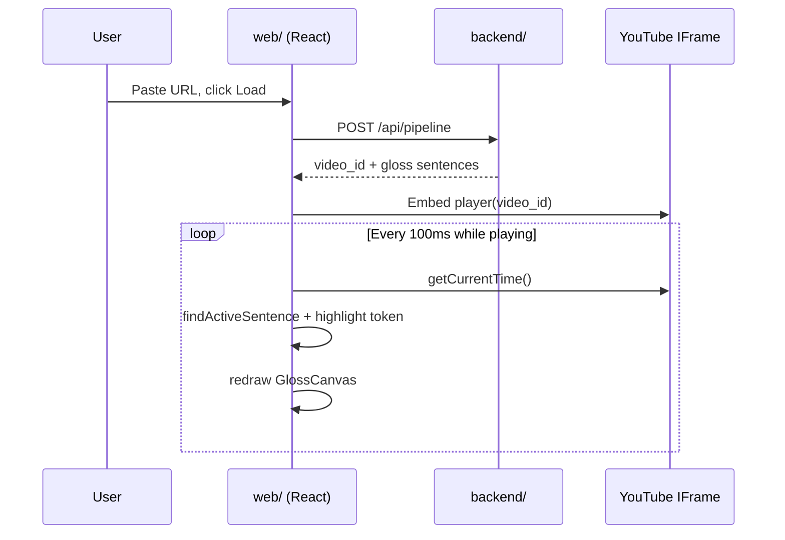

# Milestone 3 — Web Player

## Goal

A browser UI where a YouTube video plays alongside an ASL gloss overlay that tracks playback time.

## Stack

| Layer | Choice |
|-------|--------|
| UI | React 19 + TypeScript |
| Bundler | Vite 6 |
| Video | [YouTube IFrame Player API](https://developers.google.com/youtube/iframe_api_reference) |
| Overlay | HTML5 `<canvas>` (placeholder signer until M4) |
| Data | `POST /api/pipeline` from the FastAPI backend |

## User flow

## Gloss sync logic

Each gloss sentence has `start` and `end` (seconds). On each time tick:

1. Find the sentence where `start <= t < end`.
2. Split `gloss` on whitespace into tokens (e.g. `HERE ELEPHANT COOL`).
3. Map playback progress within the sentence to an active token index.
4. Draw tokens on canvas; active token uses highlight styling.

Word-level gloss timing is not available yet — tokens are distributed evenly across the sentence duration. Milestone 5 may add per-sign timing.

## Deployment modes

| Mode | Commands | URL |
|------|----------|-----|
| Dev | `uvicorn` + `npm run dev` | http://127.0.0.1:5173 |
| Single server | `npm run build` then `uvicorn` | http://127.0.0.1:8000 |

In dev, Vite proxies `/api` and `/health` to the backend. In production, FastAPI serves `web/dist/` at `/` after API routes are registered.

## Next: Milestone 4

Replace the canvas silhouette in `GlossCanvas.tsx` with a Three.js rigged avatar while keeping the same gloss sync hooks from `utils/gloss.ts`.
